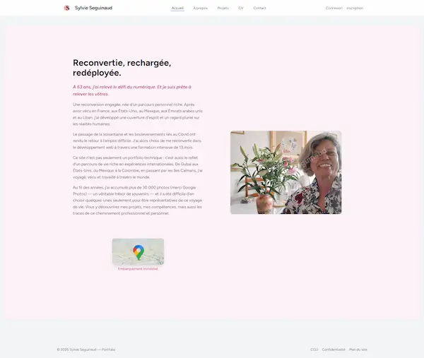
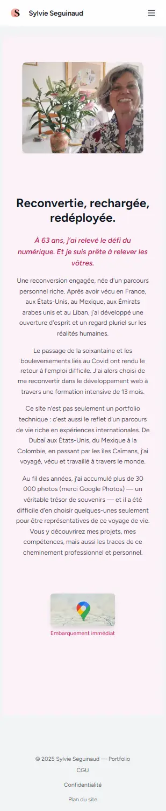
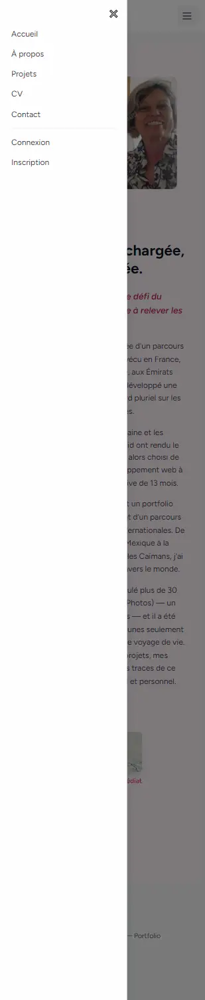
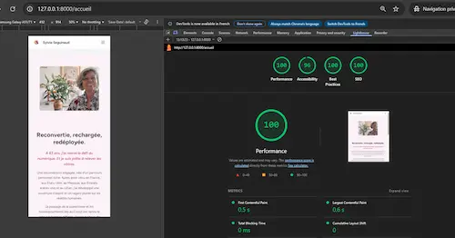
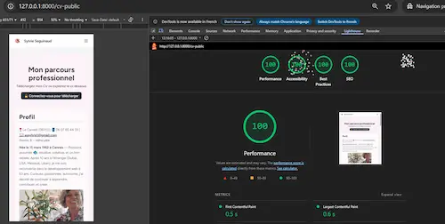
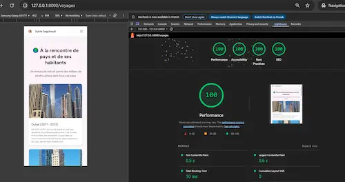

# 🌸 Portfolio Laravel – Sylvie Seguinaud

Bienvenue sur le dépôt GitHub de mon **portfolio personnel**.  
Ce site présente les **projets majeurs** réalisés durant ma formation de **Développeuse Web & Web Mobile**.  
Il ne contient pas tous mes exercices pratiques (PHP, React, JavaScript…), mais uniquement mes **projets principaux**, ceux que je présente lors de mon évaluation finale.

🌐 Mon portfolio est accessible en ligne : [sylvie-seguinaud.fr](https://sylvie-seguinaud.fr)

---

## 📖 Contexte & Objectifs

Ce portfolio a été conçu comme une **synthèse de mes compétences** acquises durant la formation **DWWM (Développeuse Web & Web Mobile)**.  
Il a pour objectifs de :  

- Mettre en valeur mes **projets techniques** et mes réalisations.  
- Démontrer ma maîtrise du **framework Laravel** et des technologies modernes (Blade, Tailwind, AlpineJS).  
- Servir de **vitrine professionnelle** pour ma recherche d’opportunités futures.  
- Illustrer ma capacité à respecter les **bonnes pratiques d’accessibilité, performance et SEO**.  

---

## 📱 Aperçu visuel

### Page d’accueil du portfolio

### Version mobile

---

## 🛠️ Stack technique utilisée

- **Framework principal** : Laravel 12.21.0  
- **Frontend** : Blade, Tailwind CSS, AlpineJS  
- **Bundler** : Vite  
- **Base de données** : SQLite (projets injectés via un Seeder)  
- **Hébergement** : PlanetHoster  
- **Outils divers** : GitHub, Figma  
- **Accessibilité** : Respect des bonnes pratiques W3C, contrastes, navigation clavier  

---

## ♿ Accessibilité & UX

Mon portfolio a été audité avec **Lighthouse** pour garantir une bonne expérience utilisateur :

- 🚀 Performance : **100 / 100**  
- ♿ Accessibilité : **100 / 100**  
- 🔒 Bonnes pratiques : **100 / 100**  
- 🔍 SEO : **100 / 100**  

### 📊 Rapport Lighthouse

---

## ⚠️ Erreurs rencontrées & solutions apportées

Pendant la réalisation de mon **portfolio Laravel**, j’ai dû corriger plusieurs erreurs et problèmes techniques :  

- **Accessibilité (Lighthouse)**  
  - Erreurs de contraste entre fond clair et texte clair → corrigées avec des couleurs plus foncées (`text-pink-800` sur `bg-pink-50`).  
  - Boutons sans label accessible (menu burger, bouton ✖) → ajout de `aria-label` et `sr-only`.  
  - Ajout de `alt` descriptifs pour toutes les images.  

- **Performance & SEO**  
  - LCP (Largest Contentful Paint) trop lent → optimisation de l’image principale avec **WebP**, `srcset`, `sizes`, `fetchpriority="high"`, et `preload`.  
  - Ajout des balises **`<meta name="description">`**, **`<link rel="canonical">`** et balises **Open Graph** pour améliorer le SEO.  
  - Définition explicite de `width` et `height` sur les images → réduction du **CLS (Cumulative Layout Shift)**.  

- **Organisation du code**  
  - Mauvais placement de fichiers Blade (`create.blade.php` mal positionné) → résolu en respectant la convention Laravel (`resources/views/editeur/articles/create.blade.php`).  
  - Navigation mobile qui ne se fermait pas correctement → corrigé avec AlpineJS (`x-show`, `@click`, transitions).  

- **Responsive design**  
  - Ajustements Tailwind pour conserver une bonne lisibilité sur tablette et mobile.  
  - Correction des tailles d’icônes et boutons pour l’accessibilité tactile.  

---

## 🛠️ Outils complémentaires utilisés

En plus de Laravel, Blade et Tailwind, j’ai utilisé :  

- 🎨 **ImageMagick (Magick)** : optimisation des images (`.jpg → .webp`), ajout de filigranes (watermark), orientation automatique.  
- 📂 **DB Browser for SQLite** : gestion et vérification des données de test dans la base SQLite.  
- 🛠️ **Lighthouse (Chrome DevTools)** : audit complet en **Performance / Accessibilité / SEO**.  
- 🚀 **PlanetHoster** : hébergement en production avec gestion du domaine et certificat SSL.  
- 📝 **Visual Studio Code (VS Code)** : éditeur principal, extensions pour Laravel, Tailwind, et Prettier pour formater le code.  
- 🧭 **Git & GitHub** : gestion de versions et suivi de l’évolution du projet.  

---

## 🚀 Améliorations futures

- 🌙 **Dark mode** pour un meilleur confort utilisateur  
- 🔍 Moteur de recherche et filtres avancés sur les projets  
- 📊 Dashboard de statistiques (visites, clics sur projets)  

---

## 👩‍💻 Auteur

**Sylvie Seguinaud**  

- 🌐 [Portfolio en ligne](https://sylvie-seguinaud.fr)  
- 💼 [LinkedIn](https://linkedin.com/in/sylvie-seguinaud)  
- 🐙 [GitHub](https://github.com/sosylvie1)  
