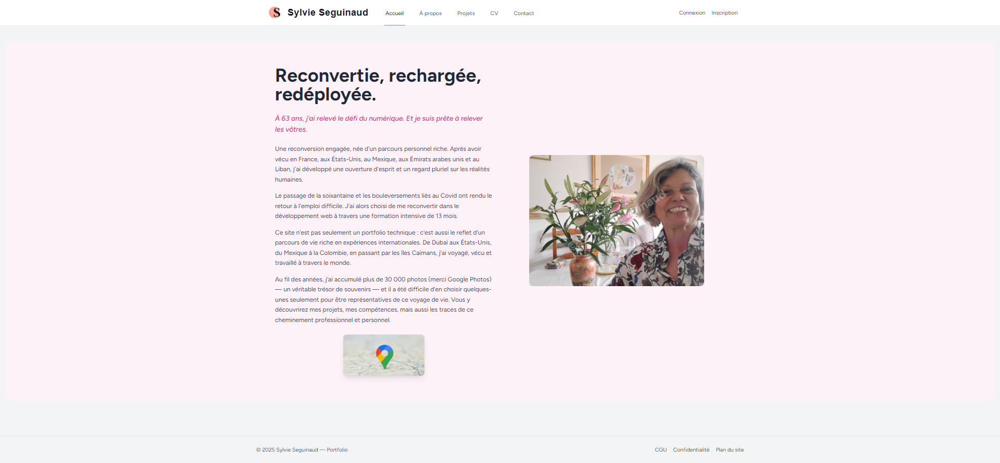
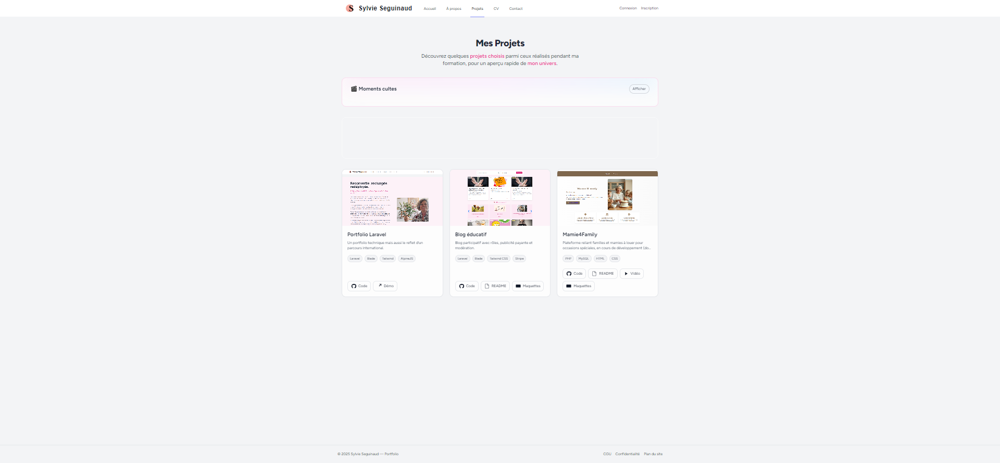
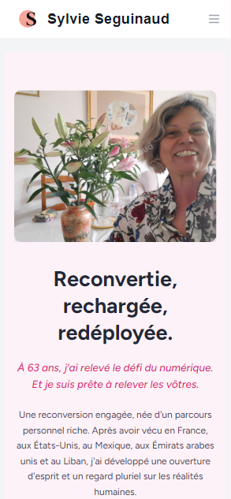
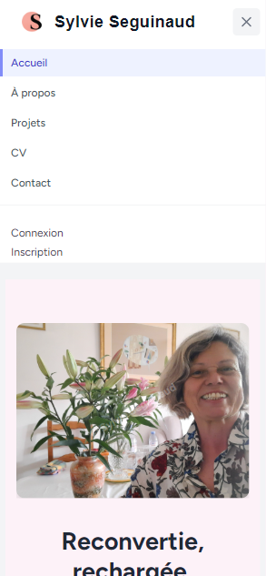
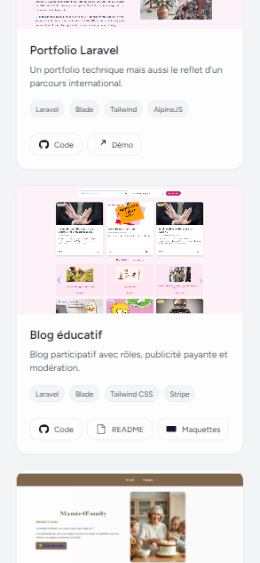
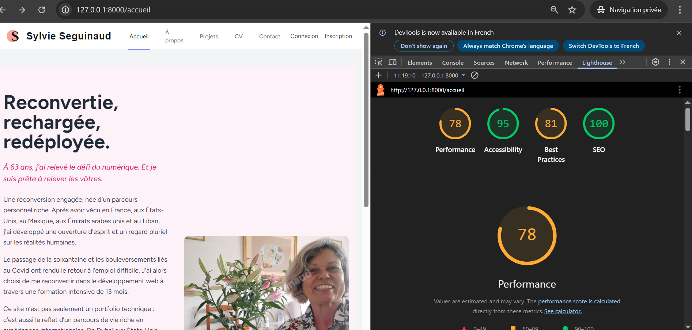

# 🌸 Portfolio Laravel – Sylvie Seguinaud

Bienvenue sur le dépôt GitHub de mon **portfolio personnel**.  
Ce site présente les **projets majeurs** réalisés durant ma formation de **Développeuse Web & Web Mobile**.  
Il ne contient pas tous mes exercices pratiques (PHP, React, JavaScript…), mais uniquement mes **projets principaux**, ceux que je présente lors de mon évaluation finale.

🌐 Mon portfolio est accessible en ligne : [sylvie-seguinaud.fr](https://sylvie-seguinaud.fr)

---

## 🎓 Projets présentés après ma formation

### 1. **Portfolio Laravel**

-   Site vitrine de mes compétences et projets
-   Technologies : Laravel, Blade, Tailwind CSS, AlpineJS
-   [Code](https://github.com/sosylvie1/portfolio) | [Site en ligne](https://sylvie-seguinaud.fr)

---

## 🎓 Projets présenté durant ma formation

### 2. **Blog éducatif – Osez Dire Non**

-   Blog participatif avec rôles (admin, éditeur)
-   Modération des articles et commentaires
-   Espace publicitaire payant avec intégration Stripe
-   [Code](https://github.com/sosylvie1/OsezDireNon)

---

### 3. **Mamie4Family**

-   Plateforme de mise en relation entre familles et mamies à louer
-   Gestion des profils, publicités, et réservations (module en cours de développement)
-   [Code](https://github.com/sosylvie1/Mamy4Family)

---

## 📱 Aperçu visuel

### Page d’accueil du portfolio

### Version mobile

---

## 🛠️ Stack technique utilisée

-   **Framework principal** : Laravel 12.21.0
-   **Frontend** : Blade, Tailwind CSS, AlpineJS
-   **Bundler** : Vite
-   **Base de données** : SQLite (projets injectés via un Seeder)
-   **Outils divers** : GitHub, Plesk, Mailtrap
-   **Accessibilité** : Respect des bonnes pratiques W3C, contrastes, navigation clavier

---

## ♿ Accessibilité & UX

## ♿ Accessibilité & UX

Mon portfolio a été audité avec **Lighthouse** pour garantir une bonne expérience utilisateur :

-   🚀 Performance : **78 / 100**
-   ♿ Accessibilité : **95 / 100**
-   🔒 Bonnes pratiques : **81 / 100**
-   🔍 SEO : **100 / 100**

### 📊 Rapport Lighthouse

## 👩‍💻 À propos

Durant ma formation DWWM, j’ai choisi de concentrer mes efforts sur ces 3 projets car ils démontrent mes compétences :

-   💡 Conception **front-end** responsive et soignée
-   ⚡ Mise en place de **back-end Laravel** robuste
-   🔐 Gestion de la sécurité et de l’authentification
-   💳 Intégration de services tiers (Stripe, Mailtrap)

---

## 🚀 Améliorations futures

-   🌙 **Dark mode** pour un meilleur confort utilisateur
-   📝 Ajout d’une section **blog personnel** dans le portfolio
-   🔍 Moteur de recherche et filtres avancés sur les projets
-   📊 Dashboard de statistiques (visites, clics sur projets)
-   📅 Système complet de **réservation** pour Mamie4Family
-   📱 Amélioration de l’accessibilité et des performances mobile

---

## 👩‍💻 Auteur

**Sylvie Seguinaud**

-   🌐 [Portfolio en ligne](https://sylvie-seguinaud.fr)
-   💼 [LinkedIn](https://linkedin.com/in/sylvie-seguinaud)
-   🐙 [GitHub](https://github.com/sosylvie1)
